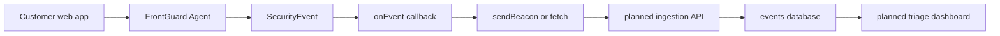

# FrontGuard Suite

FrontGuard Agent is the runtime detection layer of the FrontGuard product ecosystem. It complements the [FrontGuard Playground](https://github.com/codejupiter/frontguard), which teaches frontend security vulnerabilities through safe interactive demos.

## Product Thesis

The suite connects education and production visibility:

1. FrontGuard Playground demonstrates browser-side vulnerabilities and secure fixes.
2. FrontGuard Agent detects suspicious runtime behavior in real pages.
3. A future ingestion API stores normalized client-side security events.
4. A future dashboard helps teams triage incidents, trends, and affected releases.

This keeps the portfolio story product-grade: one project teaches the threat model, the other packages the detection primitive, and the roadmap shows how the pieces become a full SaaS product.

## Suite Map

| Surface | Status | Primary Job |
|---|---|---|
| [FrontGuard Playground](https://github.com/codejupiter/frontguard) | Live Next.js app | Teach XSS, auth storage, API exposure, RBAC, and client-side bypasses. |
| [FrontGuard Agent](https://github.com/codejupiter/frontguard-agent) | Package-ready library | Detect script injection, iframe injection, and suspicious DOM attribute mutations. |
| Event ingestion API | Planned | Validate, rate-limit, batch, and store browser security events. |
| Security dashboard | Planned | Triage events by application, release, session, source, and severity. |

## Architecture Direction



The agent intentionally avoids owning transport, authentication, storage, or dashboard concerns. Those belong in the SaaS layer so this package can stay small, framework-agnostic, and safe to embed.

## Runtime Contract

The current agent emits:

```ts
interface SecurityEvent {
  type:
    | 'dom.script-injected'
    | 'dom.iframe-injected'
    | 'dom.suspicious-attribute';
  severity: 'low' | 'medium' | 'high' | 'critical';
  timestamp: number;
  url: string;
  details: Record<string, unknown>;
}
```

A future FrontGuard backend can accept these events inside a tenant-aware envelope:

```ts
interface FrontGuardEventEnvelope {
  appId: string;
  environment: 'production' | 'preview' | 'development';
  release?: string;
  sessionId?: string;
  userId?: string;
  events: SecurityEvent[];
}
```

That design gives teams a stable client contract while leaving backend choices open: route handlers, queues, Postgres, Redis rate limits, dashboards, alerts, and audit trails can evolve independently.

## Agent Boundaries

FrontGuard Agent should remain:

- Dependency-light and framework-agnostic.
- Transport-agnostic through `onEvent`.
- Careful with privacy by emitting security context instead of full DOM snapshots.
- Lifecycle-safe for long-running SPAs through `stop()` and `getEvents()`.
- Small enough to run on production pages without creating performance drag.

It should not become:

- A full vulnerability scanner.
- A replacement for CSP, SRI, server-side authorization, or dependency auditing.
- A bundled SaaS SDK that forces one backend or analytics provider.

## Roadmap Connection

Near-term agent work should feed the larger suite:

- Add a network monitor for suspicious `fetch` and `XMLHttpRequest` destinations.
- Add a batched reporter helper without making it the only transport path.
- Correlate agent events with CSP report-only ingestion.
- Expose richer source metadata where browsers make it safe and reliable.
- Keep package-size budgets and compatibility docs visible in every release.

## Interview Talking Points

- Why the runtime agent is separate from the intentionally vulnerable playground.
- How `MutationObserver`, trusted baselines, and allowlists balance detection quality with runtime cost.
- Why `onEvent` is the right boundary between a package and a future SaaS backend.
- How the suite could scale into ingestion, triage, organizations, RBAC, and audit logs.
- Where runtime detection complements, but does not replace, browser and server security controls.
